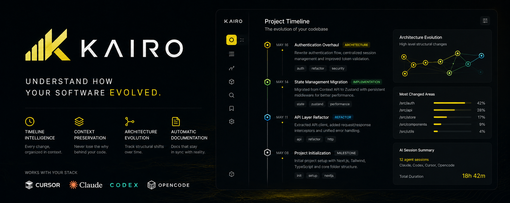

# Kairo

<p align="center">
  
</p>


> Git history for humans.

Kairo is a local-first development intelligence system that continuously reconstructs how software projects evolve.

Instead of forcing developers to manually maintain:
- changelogs
- implementation notes
- architecture journals
- project memory
- evolution timelines

Kairo observes development activity and transforms it into structured project understanding automatically.

---

# Why Kairo Exists

Modern software development became extremely fast.

Especially with:
- AI coding assistants
- autonomous agents
- massive refactors
- multi-branch workflows
- rapid architecture evolution

But understanding how a project evolved is still painfully difficult.

Git stores:

```txt
WHAT changed
```

Kairo reconstructs:

```txt
WHY it changed
```

---

# What Kairo Does

Kairo passively observes development activity such as:
- git history
- commits
- branches
- file structure evolution
- terminal workflows
- optional AI-assisted coding activity

Then continuously generates:
- development timelines
- session summaries
- architecture evolution
- implementation memory
- changelogs
- PR summaries
- searchable project history

---

# Core Philosophy

Kairo is intentionally:
- local-first
- orchestration-agnostic
- AI-compatible
- timeline-centric
- low-noise
- passive
- developer-oriented

Kairo is NOT:
- a project management tool
- a productivity tracker
- a surveillance platform
- a replacement for Git
- another AI coding framework

Kairo exists to preserve software understanding.

---

# Example

After a long development session:

```txt
Authentication Rewrite
March 4 → March 8

- migrated auth persistence
- centralized token validation
- extracted auth package
- unified middleware flow

Architecture Impact
- reduced hydration inconsistency
- simplified auth boundaries
- improved session recovery
```

Instead of reconstructing this manually weeks later.

---

# How It Works

```txt
Developer Workflow
        │
        ▼
Git / Files / Terminal / AI Activity
        │
        ▼
Observation Layer
        │
        ▼
Session Reconstruction
        │
        ▼
Evolution Intelligence
        │
        ▼
Timeline + Project Memory
```

---

# Features

## Timeline Intelligence

Kairo transforms development activity into understandable evolution timelines.

---

## Session Reconstruction

Groups related development activity into coherent implementation sessions.

---

## Architecture Evolution Tracking

Detects meaningful structural changes such as:
- framework migrations
- auth redesigns
- modularization
- state management transitions

---

## AI Workflow Compatibility

Kairo works alongside:
- AI coding assistants
- agent orchestration systems
- autonomous development workflows

instead of competing with them.

---

## Semantic Project Memory

Search project evolution by meaning instead of raw filenames.

Examples:

```txt
"auth rewrite"
"redis migration"
"routing refactor"
"why was middleware changed?"
```

---

## Passive Documentation

Kairo continuously generates:
- changelogs
- implementation summaries
- PR descriptions
- project evolution reports

without forcing developers into documentation workflows.

---

# Positioning

## Kairo is NOT:

```txt
another AI coding framework
```

## Kairo IS:

```txt
a memory and evolution layer for software projects
```

---

# Works Alongside Existing Ecosystems

Kairo is designed to work with:
- AI coding assistants
- autonomous agents
- orchestration systems
- existing developer tooling

Potential ecosystem compatibility:
- OMX
- Ruflo
- Codex workflows
- Cursor
- Claude Code
- local AI agents

Kairo focuses on:

```txt
understanding project evolution
```

while orchestration systems focus on:

```txt
executing development tasks
```

---

# Local-First

Kairo is designed around developer ownership.

Core functionality should remain usable:
- locally
- privately
- self-hosted
- without mandatory cloud dependency

---

# Roadmap

## Phase 1
- repository observation
- session reconstruction
- timeline generation
- markdown exports

## Phase 2
- semantic search
- architecture evolution detection
- AI summaries
- PR generation

## Phase 3
- AI workflow understanding
- orchestration integrations
- evolution replay
- project memory intelligence

---

# Tech Stack

Planned stack:

## Frontend
- Next.js
- TypeScript
- Tailwind CSS
- shadcn/ui

## Runtime
- Tauri
- Rust background services

## Backend
- Hono
- TypeScript

## Storage
- SQLite
- PostgreSQL later

---

# Core Principle

Kairo should reduce:

```txt
cognitive reconstruction work
```

Developers spend enormous mental energy trying to remember:
- what changed
- why it changed
- when systems evolved
- how architecture shifted

Kairo preserves that understanding automatically.

---

# Vision

The long-term vision of Kairo is:

```txt
A memory layer for AI-assisted software development.
```

As AI dramatically increases software generation speed, understanding software evolution becomes increasingly important.

Kairo exists to preserve that understanding.

---

# Status

Kairo is currently in **early scaffolding**.

Architecture and design are documented in `docs/SRS.md` and `docs/SDD.md`.
The monorepo skeleton is in place. Phase 1 work is starting.

---

# Repo Layout

```txt
kairo/
├── docs/
│   ├── SRS.md             Software Requirements Spec
│   └── SDD.md             Technical Design
├── packages/
│   ├── shared/            Normalized event + session types (zod schemas)
│   ├── utils/             Cross-cutting pure helpers (date, slug, fs)
│   └── core/              Observers, SQLite event store, session reconstructor
├── apps/
│   ├── cli/               kairo CLI (init, doctor, ingest, timeline, search, …)
│   └── mcp/               kairo-mcp — MCP server for Claude Code / Codex / Cursor
└── templates/             Hook templates + example .kairo/ workspace shape
```

# Quickstart (development)

```bash
nvm use                    # Node 22
pnpm install
pnpm typecheck

# inside another project you want Kairo to observe:
pnpm --filter @kairo/cli dev init
pnpm --filter @kairo/cli dev doctor
```

# How it integrates with your AI workflow

Kairo runs **alongside** Claude Code, Codex, Cursor — it does not replace them.

Three surfaces:

1. **Markdown sidecar** — `.kairo/timeline.md` and `.kairo/sessions/*.md` are
   plain markdown. Humans read them. AIs read them. Git can version them.
2. **MCP server** (`kairo-mcp`) — exposes tools like `kairo_recent_sessions`,
   `kairo_search`, `kairo_session_detail`, `kairo_architecture_shifts`. The AI
   you are already chatting with can ask Kairo questions mid-conversation.
3. **CLI** — `kairo timeline`, `kairo show <slug>`, `kairo search "auth rewrite"`,
   `kairo wake` (prints recent context to pipe into a fresh AI session),
   `kairo sweep` (bootstrap from existing git history).

Hooks in `.claude/hooks.json` / `.codex/hooks.json` keep observation passive —
no manual logging.

# Tech Stack (v0)

- **Runtime:** Node 22, ESM, TypeScript strict mode
- **Workspace:** pnpm + turbo
- **Storage:** SQLite via `better-sqlite3` (WAL mode)
- **Observation:** `simple-git` + `chokidar`
- **CLI:** `commander`
- **MCP:** `@modelcontextprotocol/sdk`
- **Schemas:** `zod`

Tauri desktop shell and a Vite + React dashboard are deferred to a later phase.

---

# License

MIT

